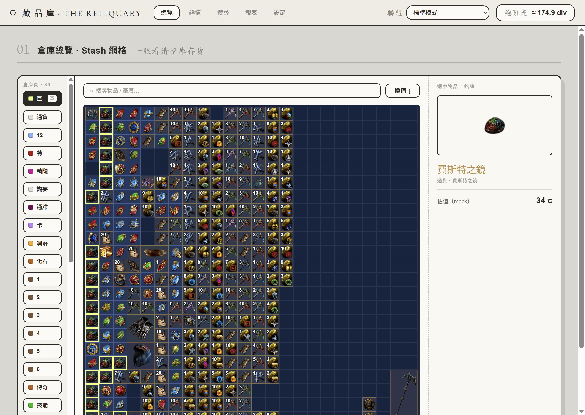

# PoE Vault Treasurer

> Path of Exile 的「金庫財務管家」桌面應用程式 — 連結你的 PoE 帳號，讀取 stash tabs、對物品估價，並追蹤你的總財富變化。

以 **Electron + TypeScript + Vite** 打造的跨平台桌面工具。目標是讓玩家在開遊戲前後快速掌握自己的資產：現在值多少 chaos / divine、各 stash tab 裡有什麼、財富隨時間怎麼變動。



> ⚠️ **目前狀態：早期開發中。** 專案骨架、建置/發佈流程、底層 HTTP 工具已就緒；UI（博物館風格 SPA，5 頁）已實作並以真實 stash 結構的 mock 資料驅動；PoE 帳號 OAuth 串接與物品估價仍在開發。下方功能清單以「已完成 / 規劃中」標示。

## 功能

**已完成**
- Electron Forge + Vite + TypeScript 專案骨架（main / preload / renderer）
- 博物館風格 SPA（hash 路由、共用狀態跨頁不中斷）：倉庫總覽 / 物品詳情 / 搜尋 / 報表 / 設定
- 倉庫總覽比照遊戲內倉庫：依物品真實座標定位、真實圖示與堆疊數、一般頁 12×12 與巨型頁 24×24、真實分頁名與顏色
- 右上角聯盟切換（啟動時抓官方公用 leagues，經主進程避開 CORS）與總資產即時換算
- 型別安全、基於原生 `fetch` 的 HTTP 工具（`src/utility/http.mod.ts`）：
  GET/POST/PUT/PATCH/DELETE、統一 `Result` 回傳格式、query 序列化、
  JSON 解析、逾時控制，以及**每分鐘速率限制**（為 GGG API 的 rate limit 預備）
- 一鍵建置成 Windows 安裝檔 + 可攜式 zip，並有 tag 觸發的自動 Release 流程

**規劃中（roadmap）**
- 透過 GGG 官方 PoE API（OAuth）登入並讀取真實 stash tabs（取代目前的 mock）
- 物品估價（poe.ninja / 官方 trade）
- 總財富儀表板：即時數值 + 歷史曲線
- 連結帳號後依 account 取得聯盟清單與多帳號切換
- 價格變動提醒

## 技術棧

| 範疇 | 選用 |
|------|------|
| 執行框架 | Electron 42 |
| 語言 | TypeScript 5.7 |
| 打包 / 開發 | Vite 8 + `@electron-forge/plugin-vite` |
| 工具鏈 | Electron Forge 7（package / make / publish） |

## 開發

需求：Node.js 20+（建議 22），npm。

```bash
npm install      # 安裝相依
npm start        # 開發模式（Vite HMR + 開啟 Electron 視窗）
```

## 建置與發佈

```bash
npm run package  # 產生可執行檔資料夾：out/PoE Vault Treasurer-win32-x64/
npm run make     # 產生發佈物：Squirrel 安裝檔 + 可攜式 zip（out/make/）
```

推送 `v*` 格式的 tag 會觸發 GitHub Actions（`.github/workflows/release.yml`），
自動建置並把安裝檔、zip 等上傳成對應的 GitHub Release：

```bash
# 先在 package.json 調好 version，再：
git tag v0.1.0 && git push origin v0.1.0
```

## 專案結構

```
├── src/
│   ├── main.ts            # Electron 主進程（建立 BrowserWindow、載入 renderer）
│   ├── preload.ts         # preload script
│   ├── pages/             # renderer（Vite root）
│   │   ├── index.html     #   renderer 進入點
│   │   └── renderer.ts    #   renderer 程式
│   ├── index.css          # 樣式
│   └── utility/
│       └── http.mod.ts    # 基於 fetch 的 HTTP 工具（含速率限制）
├── forge.config.ts        # Electron Forge 設定（makers / plugins / fuses）
├── vite.{main,preload,renderer}.config.ts
├── .github/workflows/release.yml   # tag 觸發的建置 + Release
└── tsconfig.json
```

## 授權

MIT
