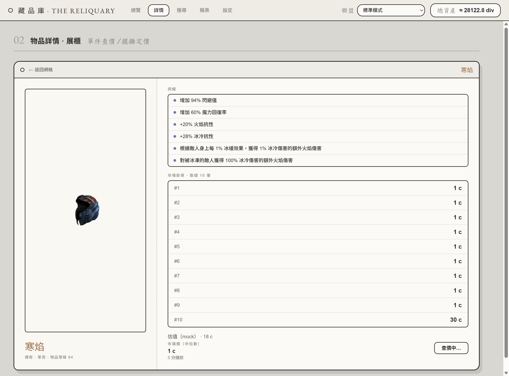
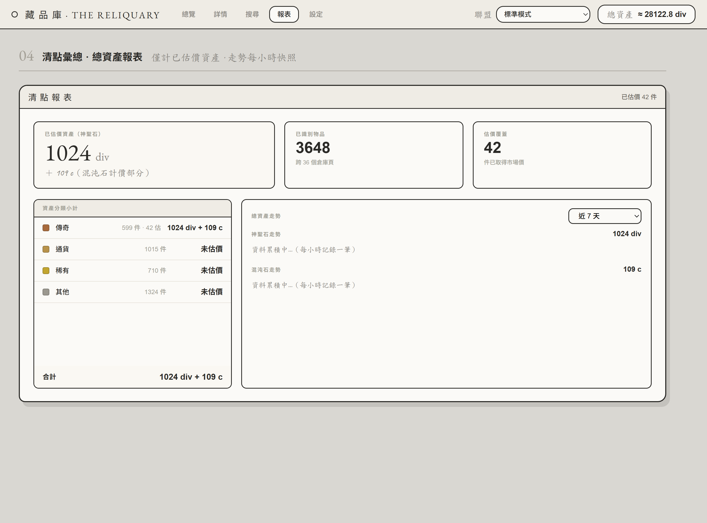

# PoE Vault Treasurer

[](https://github.com/kwangsing3/poe-coco-Treasurer/actions/workflows/release.yml)
[](https://github.com/kwangsing3/poe-coco-Treasurer/releases)
[](./LICENSE)


> Path of Exile 的「金庫財務管家」桌面應用程式 — 連結你的 PoE 帳號，讀取 stash tabs、對物品估價，並追蹤你的總財富變化。

以 **Electron + TypeScript + Vite** 打造的跨平台桌面工具。目標是讓玩家在開遊戲前後快速掌握自己的資產：現在值多少 chaos / divine、各 stash tab 裡有什麼、財富隨時間怎麼變動。


> ⚠️ **目前狀態：早期開發中。** 博物館風格 SPA（6 頁，含深色/淺色切換）已實作；倉庫資料以真實 `get-stash-items` 結構的 mock 驅動（36 分頁、約 3600 件），而**物品估價走真實官方 trade API**（含速率限制）。尚未串接帳號登入（mock 資料源），下方功能清單以「已完成 / 規劃中」標示。

## 功能

**已完成**
- Electron Forge + Vite + TypeScript 專案骨架（main / preload / renderer）
- 博物館風格 SPA（hash 路由、共用狀態跨頁不中斷）：倉庫總覽 / 物品詳情 / 搜尋 / 報表 / 物品過濾器 / 設定，左上角可切換深色/淺色主題
- 倉庫總覽比照遊戲內倉庫：依物品真實座標定位、真實圖示與堆疊數、一般頁 12×12 與巨型頁 24×24、真實分頁名與顏色
- 右上角聯盟切換（啟動時抓官方公用 leagues，經主進程避開 CORS）與總資產即時換算
- **物品估價（官方 trade API）**：兩段式 search→fetch、去離群取中位數；傳奇物品**背景查價佇列** + 依聯盟存 localStorage（開啟即有價、1 小時過期重查）
- **API 服務層（`src/api/`）**：集中所有 GGG 互動，search / fetch / exchange 各自獨立的速率限制佇列（解析 `X-Rate-Limit-*`、處理 429）
- **淨資產報表**：只計已估價資產，神聖石 / 混沌石雙幣別、分類小計與估價覆蓋率、每小時快照走勢（24h / 7d / 30d）
- 型別安全、基於原生 `fetch` 的 HTTP 工具（`src/utility/http.mod.ts`，內建速率限制）
- 一鍵建置成 Windows 安裝檔 + 可攜式 zip，並有 tag 觸發的自動 Release 流程
- **物品過濾器編輯器（對標 FilterBlade，MVP）**：讀取/匯入既有 `.filter`（含整份 NeverSink，無損保留進階條件）、依 `# [[NNNN]]` 標記分節折疊、搜尋、繁中顯示英文 `BaseType`、即時預覽外觀、匯出合法 `.filter`

**規劃中（roadmap）**
- 透過 GGG 官方 PoE API（OAuth / POESESSID）登入並讀取真實 stash tabs（關閉 `USE_MOCK` 即接上）
- 通貨估價（exchange 端點，目前只估傳奇物品）
- 連結帳號後依 account 取得聯盟清單與多帳號切換
- 價格變動提醒
- 物品過濾器：進階條件全面可編輯、套用到倉庫頁顯示、直讀台服 filter 資料夾

## 畫面

物品詳情（真實詞綴 + 官方 trade 掛單）與淨資產報表：





## 技術棧

| 範疇 | 選用 |
|------|------|
| 執行框架 | Electron 42 |
| 語言 | TypeScript 5.7 |
| 打包 / 開發 | Vite 8 + `@electron-forge/plugin-vite` |
| 工具鏈 | Electron Forge 7（package / make / publish） |

## 開發

需求：Node.js 20+（建議 22），npm。

```bash
npm install      # 安裝相依
npm start        # 開發模式（Vite HMR + 開啟 Electron 視窗）
```

## 建置與發佈

```bash
npm run package  # 產生可執行檔資料夾：out/PoE Vault Treasurer-win32-x64/
npm run make     # 產生發佈物：Squirrel 安裝檔 + 可攜式 zip（out/make/）
```

推送 `v*` 格式的 tag 會觸發 GitHub Actions（`.github/workflows/release.yml`），
自動建置並把安裝檔、zip 等上傳成對應的 GitHub Release：

```bash
# 先在 package.json 調好 version，再：
git tag v0.1.0 && git push origin v0.1.0
```

## 專案結構

```
├── src/
│   ├── main.ts            # Electron 主進程（BrowserWindow + IPC handlers）
│   ├── preload.ts         # contextBridge：把 window.poe 暴露給 renderer
│   ├── api/               # GGG API 服務層（主進程用）
│   │   ├── trade.ts       #   聯盟 / 物品估價 / 通貨兌換
│   │   ├── tradePrice.ts  #   去離群取中位數
│   │   ├── rateLimiter.ts #   search/fetch/exchange 速率限制佇列
│   │   ├── stash.ts       #   倉庫物品（目前回 mock）
│   │   ├── staticData.ts  #   通貨名稱→trade code
│   │   └── …              #   client / endpoints / types / index
│   ├── pages/             # renderer（Vite root，瀏覽器情境）
│   │   ├── index.html
│   │   ├── renderer.ts
│   │   └── app/           #   SPA：router / store / stash / prices / networth / views
│   ├── index.css
│   └── utility/http.mod.ts   # 基於 fetch 的 HTTP 工具（含速率限制）
├── mock/                  # 離線 mock（trade-data 靜態資料 + stash 36 頁）
├── docs/                  # README 截圖
├── forge.config.ts        # Electron Forge 設定（makers / plugins / fuses）
├── vite.{main,preload,renderer}.config.ts
├── .github/workflows/release.yml   # tag 觸發的建置 + Release
└── tsconfig.json
```

## 授權

MIT
